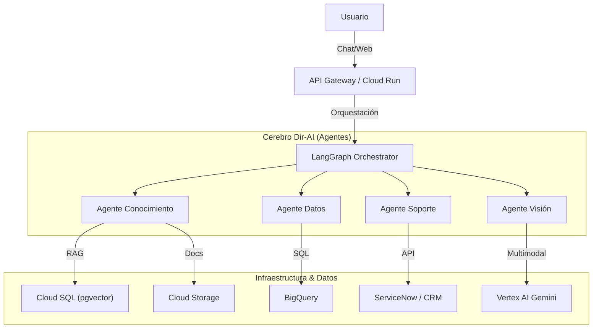

# Dir-AI Core App

**Un producto de GuanaCloud**


## 🚀 Visión del Producto

**Dir-AI** es la solución definitiva de Inteligencia Artificial Multi-Agente diseñada por **GuanaCloud** para transformar la operación empresarial. Concebida como un "Cerebro Digital", Dir-AI orquesta múltiples agentes especializados para resolver tareas complejas de forma autónoma, desde la gestión del conocimiento hasta el soporte técnico y el análisis de datos.

Ofrecemos Dir-AI en dos modalidades para adaptarse a cualquier necesidad:
1.  **SaaS Self-Service**: Una solución "Lite" lista para usar, ideal para capturar leads y resolver consultas frecuentes, integrable en cualquier sitio web mediante un widget.
2.  **Full-Code Enterprise**: Una implementación personalizada y potente que se integra profundamente con los sistemas corporativos (ERP, CRM, DWH) para una automatización total.

---

## 💼 Perspectiva de Negocio

### Valor Propuesta
*   **Eficiencia Operativa**: Reduce la carga en equipos de soporte y análisis hasta en un 60%.
*   **Disponibilidad 24/7**: Tus clientes y empleados tienen respuestas instantáneas en cualquier momento.
*   **Escalabilidad**: Desde una pequeña startup que necesita un chatbot inteligente hasta una corporación que requiere análisis de BigQuery y gestión de incidentes en ServiceNow.

### Casos de Uso
*   **Atención al Cliente**: Resolución automática de dudas sobre productos y servicios.
*   **Soporte Técnico (Helpdesk)**: Creación y gestión de tickets de soporte sin intervención humana inicial.
*   **Inteligencia de Negocios**: Los ejecutivos pueden "chatear" con sus datos (Data Warehouse) para obtener reportes en tiempo real.
*   **Gestión del Conocimiento**: Centraliza manuales, políticas y documentos en una base de conocimiento consultable con lenguaje natural.

---

## 🎨 Experiencia de Usuario (UI/UX)

Aunque este repositorio aloja el **Core Backend**, la experiencia de usuario está diseñada para ser fluida y adaptable:

### 1. Widget Web (Modo Lite)
*   **Diseño**: Minimalista y moderno, personalizable con los colores de la marca.
*   **Funcionalidad**: Ventana de chat flotante en la esquina inferior derecha.
*   **Interacción**:
    *   Saludo proactivo.
    *   Respuestas rápidas basadas en la Base de Conocimiento.
    *   Escalamiento a ticket de soporte si la IA no puede resolver la duda.
    *   Captura de datos de contacto (Leads).

### 2. Consola Empresarial (Modo Full)
*   **Dashboard**: Visualización de métricas de uso, temas más consultados y rendimiento de los agentes.
*   **Gestión de Documentos**: Interfaz "Drag & Drop" para subir PDFs, TXTs y otros documentos a la Base de Conocimiento.
*   **Chat Avanzado**: Interfaz de chat completa con soporte para:
    *   Gráficos y tablas de datos (generados por el Agente DWH).
    *   Tarjetas de estado de tickets (ServiceNow).
    *   Carga de imágenes para análisis visual.

---

## 🛠 Arquitectura Técnica

Dir-AI está construido sobre una arquitectura moderna, serverless y escalable en **Google Cloud Platform (GCP)**.

### Diagrama de Alto Nivel


### Componentes Clave

#### 1. Orquestador (LangGraph)
El corazón del sistema. Utiliza un grafo de estados para manejar la conversación, mantener el contexto y decidir qué herramienta o agente activar.
*   **Persistencia**: Estado de la conversación guardado en **Firestore**.
*   **Modos**:
    *   `Lite`: Activa solo herramientas de Conocimiento y Captura de Leads.
    *   `Full`: Habilita acceso a DWH, ServiceNow y herramientas avanzadas.

#### 2. Agentes Especializados
*   **Knowledge Base Agent**:
    *   **Motor**: RAG (Retrieval-Augmented Generation).
    *   **Embeddings**: `text-embedding-005` de Vertex AI.
    *   **Almacenamiento**: PostgreSQL con extensión `pgvector` (solución costo-eficiente frente a Vector Search para volúmenes medios).
    *   **Documentos**: Almacenados en Google Cloud Storage (Buckets dinámicos por cliente).
*   **Data Warehouse Agent**:
    *   **Motor**: Generación de SQL a partir de Lenguaje Natural (Text-to-SQL).
    *   **Fuente**: BigQuery (Dataset público `thelook_ecommerce` para demos, adaptable a datos corporativos).
    *   **Seguridad**: Ejecución de consultas de solo lectura dentro del perímetro del proyecto.
*   **Support Agent**:
    *   **Integración**: Conector simulado para **ServiceNow** (Incident Management).
    *   **Capacidades**: Crear, Leer, Actualizar y Cerrar incidentes.
*   **Vision Agent**:
    *   **Motor**: Gemini 2.5 Flash (Multimodal).
    *   **Capacidades**: Análisis de imágenes, extracción de datos de facturas o daños en vehículos.

#### 3. Servicios Core
*   **Notification Service**: Sistema planificado para envío multicanal (Email, Chat, SMS) de alertas y seguimientos.
*   **API**: Desarrollada en **FastAPI** (Python), expuesta vía Cloud Run.

### Stack Tecnológico
*   **Lenguaje**: Python 3.11+
*   **Framework AI**: LangChain / LangGraph / Google GenAI SDK
*   **Modelos**: Gemini 2.5 Flash (Balance ideal entre velocidad y costo).
*   **Base de Datos**:
    *   Cloud SQL (PostgreSQL) para vectores y datos relacionales.
    *   Firestore para sesiones y chat history.
    *   BigQuery para analítica.
*   **Infraestructura**: Docker, Cloud Run.

---

## 🚀 Despliegue y Configuración

### Prerrequisitos
*   Proyecto en Google Cloud Platform.
*   APIs habilitadas: Vertex AI, Cloud Run, Cloud Build, Secret Manager.
*   Instancia de Cloud SQL (Postgres) y Firestore.

### Variables de Entorno (.env)
```bash
GCP_PROJECT_ID=tu-proyecto-id
LOCATION=us-central1
GEMINI_MODEL_ID=gemini-2.5-flash
DB_CONNECTION_NAME=proyecto:region:instancia
DB_USER=postgres
DB_PASS=secreto
FIRESTORE_DATABASE_ID=(default)
```

### Ejecución Local
```bash
# Instalar dependencias
pip install -r requirements.txt

# Ejecutar servidor
uvicorn main:app --reload
```

---

**Dir-AI** © 2025 GuanaCloud. Todos los derechos reservados.
Transformando el futuro del trabajo con Inteligencia Artificial.
